# Emotion and Entity Analysis using NLP Techniques

This repository presents a multi-stage NLP project focused on classifying emotions, performing topic modeling, extracting biomedical entities, and comparing semantic similarities between disease-related terms using both classical and deep learning techniques.

---

## 📁 Repository Structure

```
├── Notebooks/
│   ├── Naive_Bayes_1.1.ipynb
│   ├── Text_Analytics_1.2_Final_CNN.ipynb
│   ├── Text_Analytics_1.4_NMF.ipynb
│   ├── 2.1.ipynb
│   ├── Text_Analytics_2.3.ipynb
├── Text_Analytics.pdf
├── images/
│   └── *.png (extracted output visuals from notebooks)
├── README.md
```

---

## 📊 Task Breakdown & Methodologies

### Task 1: Emotion Classification

#### 🧮 Naive Bayes Classifier
- Classical probabilistic approach using bag-of-words features.
- Preprocessing: tokenization, stopword removal, lemmatization.
- Accuracy: ~67%
- F1-Score: Moderate; struggled with nuanced classes like “optimism” and “sadness.”

#### 🧠 Convolutional Neural Network (CNN)
- Implemented using Keras with GloVe embeddings.
- Architecture:
  - 1D convolution over embedded text
  - MaxPooling and dropout layers
- Accuracy: ~70.2%
- F1-Score: ~0.63
- Observed better generalization and deeper context modeling than Naive Bayes.

### Task 2: Biomedical Named Entity Recognition (NER)

#### 🧬 RoBERTa Sequence Tagger
- Leveraged HuggingFace’s `transformers` for token classification.
- Trained with BIO tagging on biomedical entity datasets.
- Precision & Recall: Very high on entities like “Disease”, “Protein”.
- Notable Challenges: Boundary detection, ambiguity in multi-entity tokens.

### Task 3: Topic Modeling on Joy & Optimism

#### 🧠 Non-negative Matrix Factorization (NMF)
- TF-IDF vectorization followed by latent topic extraction.
- Topics were coherent, interpretable and distinct between emotion categories.
- Highlighted major themes like:
  - “birthday, celebration, love” for joy
  - “hope, belief, future” for optimism

### Task 4: Entity Similarity

#### 📌 Word2Vec vs BERT Embeddings
- Used cosine similarity between embedded vectors.
- Word2Vec: Faster, interpretable, less contextual.
- BERT: More semantically aware, handled context-rich similarity.
- "Dyskinesia" was found similar to: "tremor", "ataxia", "bradykinesia" using BERT.

---

## 📈 Evaluation Metrics Summary

| Model         | Accuracy | F1-Score | Notes |
|---------------|----------|----------|-------|
| Naive Bayes   | ~67%     | ~0.58    | Fast but poor at nuanced emotions |
| CNN + GloVe   | ~70.2%   | ~0.63    | Captured richer features |
| RoBERTa (NER) | N/A      | ~0.90+   | Excellent on entity detection |
| BERT (Similarity) | N/A  | N/A      | Most context-aware semantic retrieval |

---

## 🖼️ Extracted Results & Visualizations

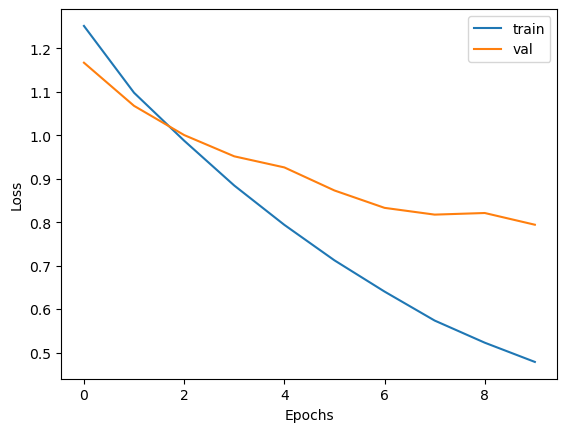
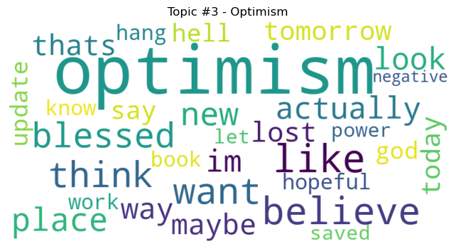

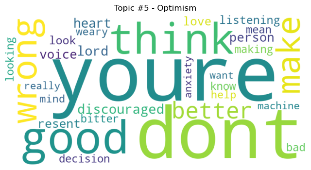
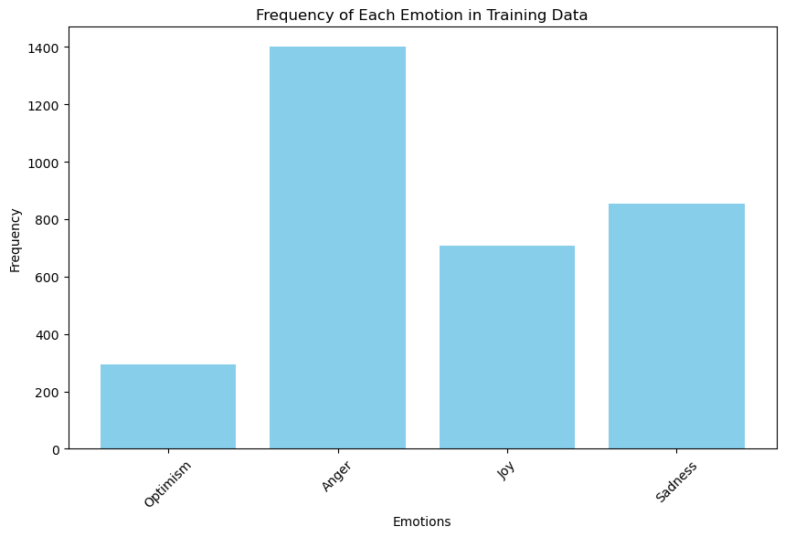
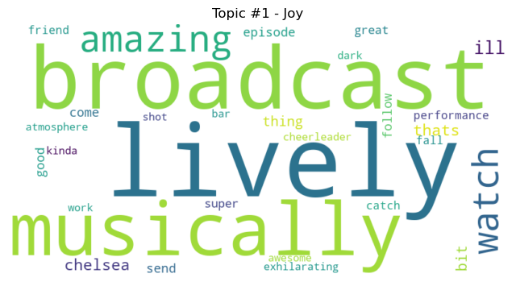
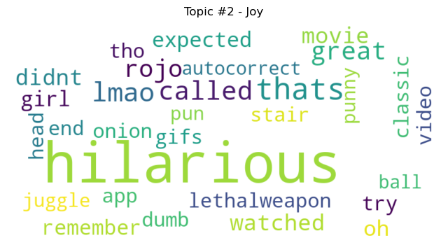
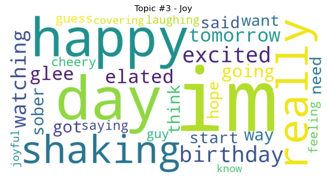
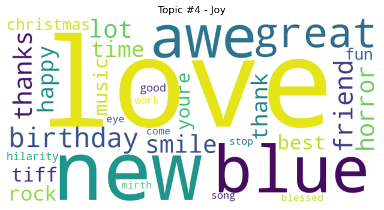
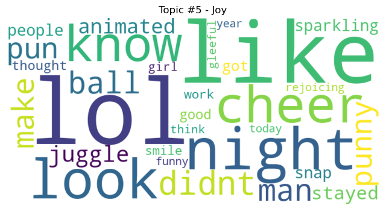
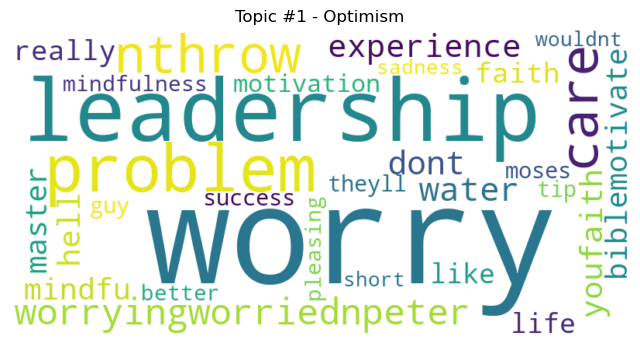
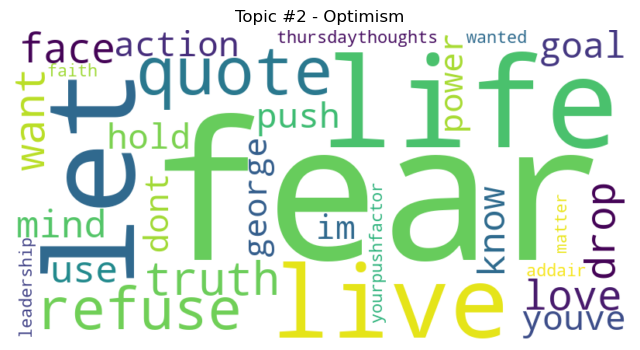

---

## 🧪 How to Run

```bash
# Install dependencies
pip install -r requirements.txt

# Run the notebook
jupyter notebook Naive_Bayes_1.1.ipynb
```

Make sure all notebooks and required data are in the root directory.

---

## 📚 References

- IBM Naive Bayes NLP Blog
- GloVe: Pennington et al. (2014)
- RoBERTa: Liu et al. (2019)
- BERT: Devlin et al. (2018)
- Becht et al. on UMAP
- Medium & TowardsDataScience articles (as cited in report)

---

## 👨‍💻 Author

**Uchit Bhadauriya**  
MSc Data Science – University of Bristol  
📧 ir23063@bristol.ac.uk  
🔗 [LinkedIn](https://www.linkedin.com/in/uchit-bhadauriya-a96478204)

---

⭐ Star this repo if it helped you!  
🔁 Fork to extend the work  
❓ Raise an issue for collaboration or feedback.
